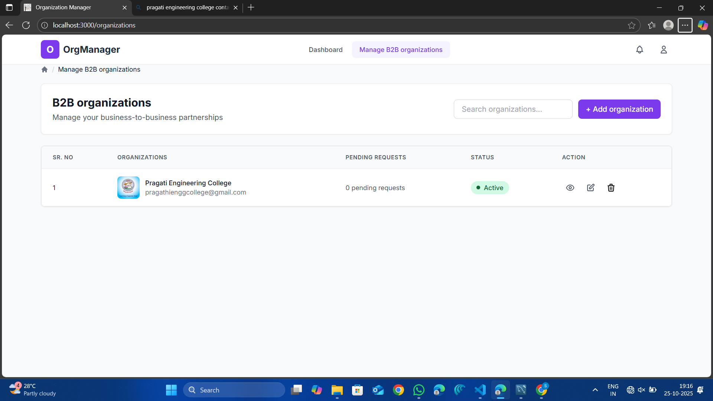
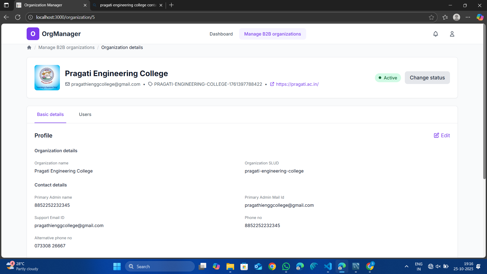
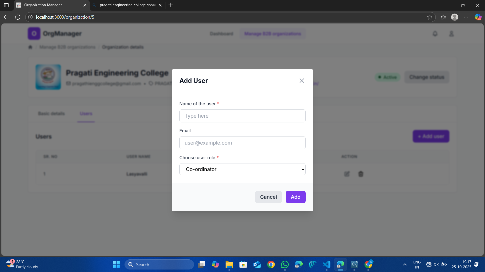
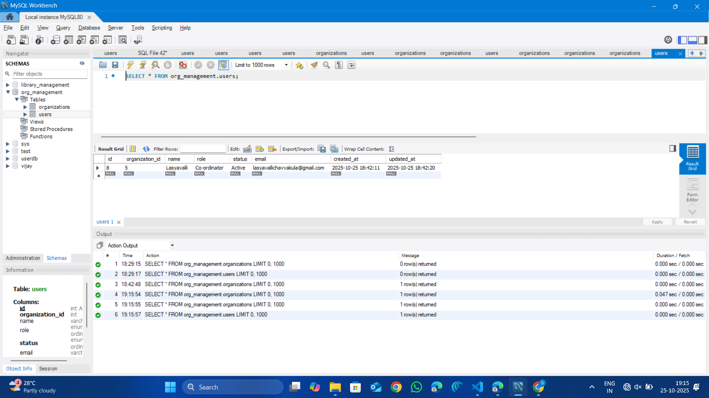
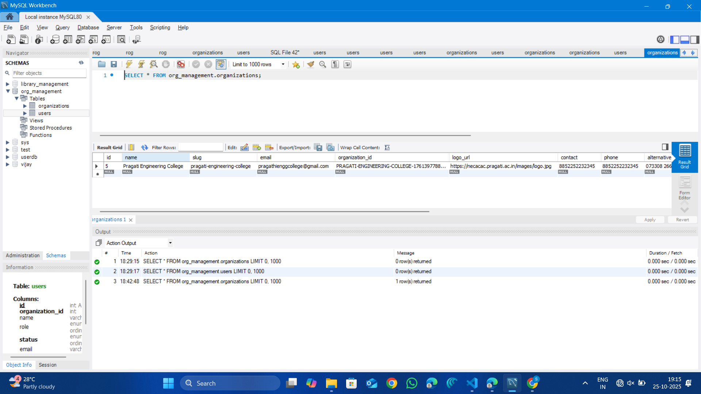

# Organization & Users Management System

A full-stack web application for managing B2B organizations and their users, built with React, Node.js, and MySQL.


## 📋 Table of Contents

- [Overview](#overview)
- [Features](#features)
- [Tech Stack](#tech-stack)
- [Database Schema](#database-schema)
- [Screenshots](#screenshots)
- [Getting Started](#getting-started)
- [Project Structure](#project-structure)
- [API Endpoints](#api-endpoints)
- [Environment Variables](#environment-variables)
- [Usage](#usage)
- [Contributing](#contributing)
- [License](#license)
- [Author](#author)

## 🎯 Overview

This project is a comprehensive organization and user management system designed for B2B partnerships. It allows administrators to manage multiple organizations, add users to organizations with specific roles, and maintain detailed organizational information including contact details, timezone, language preferences, and more.

**Developed as part of**: Full Stack Developer Task - Pragati Engineering College

## ✨ Features

### Organization Management
- ✅ Create new organizations with complete details
- ✅ View all organizations in a clean, organized list
- ✅ Edit organization information
- ✅ Delete organizations
- ✅ Change organization status (Active/Inactive)
- ✅ Search organizations
- ✅ View organization details including:
  - Organization name and slug
  - Contact information (email, phone, alternative phone)
  - Timezone and language settings
  - Official website URL
  - Region information
  - Maximum allowed coordinators
  - Organization ID

### User Management
- ✅ Add users to specific organizations
- ✅ Assign user roles (Co-ordinator)
- ✅ View user lists per organization
- ✅ Edit user information
- ✅ Delete users
- ✅ Manage user status
- ✅ Email-based user identification

### UI/UX Features
- ✅ Fully responsive design (mobile, tablet, desktop)
- ✅ Modern and clean interface using Tailwind CSS
- ✅ Loading states for async operations
- ✅ Error handling with user-friendly messages
- ✅ Form validation
- ✅ Modal dialogs for add/edit operations
- ✅ Tabbed interface for organization details
- ✅ Action buttons with icons (view, edit, delete)

## 🛠️ Tech Stack

### Frontend
- **Framework**: React.js 18.x
- **Styling**: Tailwind CSS 3.x
- **HTTP Client**: Axios
- **Routing**: React Router DOM v6
- **Icons**: Lucide React / Font Awesome
- **Build Tool**: Create React App / Vite

### Backend
- **Runtime**: Node.js (v14+)
- **Framework**: Express.js 4.x
- **Database**: MySQL 8.x
- **ORM/Query Builder**: mysql2 package
- **Middleware**: 
  - CORS
  - Body Parser
  - Express JSON

### Development Tools
- **Version Control**: Git
- **API Testing**: Postman
- **Database Management**: MySQL Workbench
- **Code Editor**: VS Code

## 📊 Database Schema

### Database Structure

#### Tables Overview

**1. Organizations Table**
```sql
CREATE TABLE organizations (
  id INT PRIMARY KEY AUTO_INCREMENT,
  name VARCHAR(255) NOT NULL,
  slug VARCHAR(255) UNIQUE NOT NULL,
  email VARCHAR(255) NOT NULL,
  contact VARCHAR(255),
  phone VARCHAR(20),
  alternative_phone VARCHAR(20),
  organization_id VARCHAR(100) UNIQUE,
  logo_url TEXT,
  timezone VARCHAR(50),
  language VARCHAR(50),
  region VARCHAR(100),
  website_url TEXT,
  max_coordinators INT DEFAULT 5,
  status ENUM('Active', 'Inactive') DEFAULT 'Active',
  created_at TIMESTAMP DEFAULT CURRENT_TIMESTAMP,
  updated_at TIMESTAMP DEFAULT CURRENT_TIMESTAMP ON UPDATE CURRENT_TIMESTAMP
);
```

**2. Users Table**
```sql
CREATE TABLE users (
  id INT PRIMARY KEY AUTO_INCREMENT,
  organization_id INT NOT NULL,
  name VARCHAR(255) NOT NULL,
  email VARCHAR(255) NOT NULL,
  role VARCHAR(50) NOT NULL,
  status ENUM('Active', 'Inactive') DEFAULT 'Active',
  created_at TIMESTAMP DEFAULT CURRENT_TIMESTAMP,
  updated_at TIMESTAMP DEFAULT CURRENT_TIMESTAMP ON UPDATE CURRENT_TIMESTAMP,
  FOREIGN KEY (organization_id) REFERENCES organizations(id) ON DELETE CASCADE
);
```

### Entity Relationships

- **One-to-Many**: One Organization can have multiple Users
- **Foreign Key**: Users.organization_id references Organizations.id
- **Cascade Delete**: Deleting an organization removes all associated users

## ER Diagram
```
┌─────────────────────────┐         ┌─────────────────────────┐
│    ORGANIZATIONS        │         │        USERS            │
├─────────────────────────┤         ├─────────────────────────┤
│ PK: id (INT)            │         │ PK: id (INT)            │
│                         │    1:N  │ FK: organization_id     │
│ name                    │─────────│                         │
│ slug (UNIQUE)           │         │ name                    │
│ email                   │         │ email                   │
│ contact                 │         │ role                    │
│ phone                   │         │ status                  │
│ alternative_phone       │         │ created_at              │
│ organization_id (UNIQUE)│         │ updated_at              │
│ logo_url                │         └─────────────────────────┘
│ timezone                │
│ language                │
│ region                  │
│ website_url             │
│ max_coordinators        │
│ status                  │
│ created_at              │
│ updated_at              │
└─────────────────────────┘
```

**Relationship:** One organization can have many users (1:N)
**Constraint:** ON DELETE CASCADE

## 📸 Screenshots

### 1. Organizations List View

*Main dashboard displaying all B2B organizations with search functionality and action buttons*

---

### 2. Add Organization Modal

*Comprehensive form to create a new organization with fields for:*
- Organization name and slug
- Email and contact information
- Phone numbers (primary and alternative)
- Timezone and language selection
- Region and website URL
- Maximum allowed coordinators

---

### 3. Organization Details - Users Tab

*User management interface showing:*
- List of all users in the organization
- User roles and status
- Add, edit, and delete user actions
- User serial numbers and names

---

### 4. Add User Modal

*Simple form to add new users with:*
- Name input field
- Email address
- Role selection dropdown (Co-ordinator)
- Form validation

---

### 5. Organization Details - Basic Details Tab

*Detailed view of organization information including:*
- Organization profile
- Contact details section
- Phone numbers
- Support email
- Alternative contact information
- Region and timezone settings
- Official website link
- Status indicator

---

### 6. Database - Users Table

*MySQL Workbench view showing:*
- Users table structure
- Sample user data
- Column definitions (id, organization_id, name, role, status, email, created_at, updated_at)
- Actual stored data in the database

---

### 7. Database - Organizations Table

*MySQL Workbench view showing:*
- Organizations table structure
- Sample organization data
- All column definitions
- Complete organization records with timestamps

---

## 🚀 Getting Started

### Prerequisites

Before you begin, ensure you have the following installed:

- **Node.js** (v14.0 or higher)
```bash
  node --version
```

- **npm** (v6.0 or higher) or **yarn**
```bash
  npm --version
```

- **MySQL** (v8.0 or higher)
```bash
  mysql --version
```

- **Git**
```bash
  git --version
```

### Installation Steps

#### 1. Clone the Repository
```bash
git clone https://github.com/yourusername/org-management-system.git
cd org-management-system
```

#### 2. Database Setup

**Step 2.1: Create Database**
```bash
# Login to MySQL
mysql -u root -p

# In MySQL prompt, create database
CREATE DATABASE org_management;
USE org_management;
```

**Step 2.2: Create Tables**
```sql
-- Organizations Table
CREATE TABLE organizations (
  id INT PRIMARY KEY AUTO_INCREMENT,
  name VARCHAR(255) NOT NULL,
  slug VARCHAR(255) UNIQUE NOT NULL,
  email VARCHAR(255) NOT NULL,
  contact VARCHAR(255),
  phone VARCHAR(20),
  alternative_phone VARCHAR(20),
  organization_id VARCHAR(100) UNIQUE,
  logo_url TEXT,
  timezone VARCHAR(50),
  language VARCHAR(50),
  region VARCHAR(100),
  website_url TEXT,
  max_coordinators INT DEFAULT 5,
  status ENUM('Active', 'Inactive') DEFAULT 'Active',
  created_at TIMESTAMP DEFAULT CURRENT_TIMESTAMP,
  updated_at TIMESTAMP DEFAULT CURRENT_TIMESTAMP ON UPDATE CURRENT_TIMESTAMP
);

-- Users Table
CREATE TABLE users (
  id INT PRIMARY KEY AUTO_INCREMENT,
  organization_id INT NOT NULL,
  name VARCHAR(255) NOT NULL,
  email VARCHAR(255) NOT NULL,
  role VARCHAR(50) NOT NULL,
  status ENUM('Active', 'Inactive') DEFAULT 'Active',
  created_at TIMESTAMP DEFAULT CURRENT_TIMESTAMP,
  updated_at TIMESTAMP DEFAULT CURRENT_TIMESTAMP ON UPDATE CURRENT_TIMESTAMP,
  FOREIGN KEY (organization_id) REFERENCES organizations(id) ON DELETE CASCADE
);
```

**Alternative: Use SQL File**
```bash
mysql -u root -p org_management < database/schema.sql
```

#### 3. Backend Setup
```bash
# Navigate to backend directory
cd backend

# Install dependencies
npm install

# Create environment file
cp .env.example .env
```

**Edit `.env` file:**
```env
# Server Configuration
PORT=5000
NODE_ENV=development

# Database Configuration
DB_HOST=localhost
DB_USER=root
DB_PASSWORD=your_mysql_password
DB_NAME=org_management
DB_PORT=3306

# CORS Configuration
CORS_ORIGIN=http://localhost:3000
```

#### 4. Frontend Setup
```bash
# Navigate to frontend directory (from project root)
cd frontend

# Install dependencies
npm install

# Create environment file
cp .env.example .env
```

**Edit `.env` file:**
```env
REACT_APP_API_URL=http://localhost:5000/api
REACT_APP_NAME=OrgManager
```

#### 5. Running the Application

**Terminal 1 - Backend Server:**
```bash
cd backend
npm start

# Expected output:
# Server is running on port 5000
# MySQL Database Connected!
```

**Terminal 2 - Frontend Development Server:**
```bash
cd frontend
npm start

# Expected output:
# Compiled successfully!
# webpack compiled with 0 warnings
# 
# Local:            http://localhost:3000
# On Your Network:  http://192.168.1.x:3000
```

#### 6. Access the Application

Open your browser and navigate to:
```
http://localhost:3000
```

The backend API will be running on:
```
http://localhost:5000
```

## 🔌 API Endpoints

### Base URL
```
http://localhost:5000/api
```

### Organizations Endpoints

#### 1. Get All Organizations
```http
GET /api/organizations
```

**Response:**
```json
{
  "success": true,
  "data": [
    {
      "id": 1,
      "name": "Pragati Engineering College",
      "slug": "pragati-engineering-college",
      "email": "pragathienggcollege@gmail.com",
      "contact": "8852252232345",
      "phone": "8852252232345",
      "alternative_phone": "073308 26667",
      "organization_id": "PRAGATI-ENGINEERING-COLLEGE-1761397788422",
      "logo_url": "https://necacac.pragati.ac.in/images/logo.jpg",
      "timezone": "Asia/Colombo",
      "language": "English",
      "region": "India",
      "website_url": "https://pragati.ac.in/",
      "max_coordinators": 5,
      "status": "Active",
      "created_at": "2025-10-25T18:42:20.000Z",
      "updated_at": "2025-10-25T18:42:20.000Z"
    }
  ]
}
```

#### 2. Get Organization by ID
```http
GET /api/organizations/:id
```

**Parameters:**
- `id` (path parameter): Organization ID

**Response:**
```json
{
  "success": true,
  "data": {
    "id": 1,
    "name": "Pragati Engineering College",
    // ... other fields
  }
}
```

#### 3. Create Organization
```http
POST /api/organizations
```

**Request Body:**
```json
{
  "name": "Example Organization",
  "slug": "example-organization",
  "email": "contact@example.com",
  "contact": "John Doe",
  "phone": "+1-234-567-8900",
  "alternative_phone": "+1-234-567-8901",
  "timezone": "Asia/Colombo",
  "language": "English",
  "region": "North America",
  "website_url": "https://example.com",
  "max_coordinators": 5
}
```

**Response:**
```json
{
  "success": true,
  "message": "Organization created successfully",
  "data": {
    "id": 2,
    "name": "Example Organization",
    "organization_id": "EXAMPLE-ORGANIZATION-1729878000000",
    // ... other fields
  }
}
```

#### 4. Update Organization
```http
PUT /api/organizations/:id
```

**Parameters:**
- `id` (path parameter): Organization ID

**Request Body:**
```json
{
  "name": "Updated Organization Name",
  "email": "newemail@example.com",
  // ... other fields to update
}
```

**Response:**
```json
{
  "success": true,
  "message": "Organization updated successfully",
  "data": {
    "id": 1,
    "name": "Updated Organization Name",
    // ... updated fields
  }
}
```

#### 5. Delete Organization
```http
DELETE /api/organizations/:id
```

**Parameters:**
- `id` (path parameter): Organization ID

**Response:**
```json
{
  "success": true,
  "message": "Organization deleted successfully"
}
```

#### 6. Change Organization Status
```http
PATCH /api/organizations/:id/status
```

**Request Body:**
```json
{
  "status": "Inactive"
}
```

**Response:**
```json
{
  "success": true,
  "message": "Organization status updated successfully"
}
```

### Users Endpoints

#### 1. Get Users by Organization
```http
GET /api/users/organization/:orgId
```

**Parameters:**
- `orgId` (path parameter): Organization ID

**Response:**
```json
{
  "success": true,
  "data": [
    {
      "id": 1,
      "organization_id": 5,
      "name": "Lasyavalli",
      "email": "lasyavallicharvalula@gmail.com",
      "role": "Co-ordinator",
      "status": "Active",
      "created_at": "2025-10-25T18:42:11.000Z",
      "updated_at": "2025-10-25T18:42:20.000Z"
    }
  ]
}
```

#### 2. Create User
```http
POST /api/users
```

**Request Body:**
```json
{
  "organization_id": 1,
  "name": "Jane Smith",
  "email": "jane.smith@example.com",
  "role": "Co-ordinator"
}
```

**Response:**
```json
{
  "success": true,
  "message": "User created successfully",
  "data": {
    "id": 2,
    "organization_id": 1,
    "name": "Jane Smith",
    "email": "jane.smith@example.com",
    "role": "Co-ordinator",
    "status": "Active"
  }
}
```

#### 3. Update User
```http
PUT /api/users/:id
```

**Parameters:**
- `id` (path parameter): User ID

**Request Body:**
```json
{
  "name": "Jane Doe",
  "email": "jane.doe@example.com",
  "role": "Co-ordinator"
}
```

**Response:**
```json
{
  "success": true,
  "message": "User updated successfully"
}
```

#### 4. Delete User
```http
DELETE /api/users/:id
```

**Parameters:**
- `id` (path parameter): User ID

**Response:**
```json
{
  "success": true,
  "message": "User deleted successfully"
}
```

### Error Responses

All endpoints may return error responses in the following format:
```json
{
  "success": false,
  "error": "Error message describing what went wrong"
}
```

**Common HTTP Status Codes:**
- `200` - Success
- `201` - Created
- `400` - Bad Request
- `404` - Not Found
- `500` - Internal Server Error

## 🔐 Environment Variables

### Backend (.env)
```env
# Server Configuration
PORT=5000
NODE_ENV=development

# Database Configuration
DB_HOST=localhost
DB_USER=root
DB_PASSWORD=your_mysql_password
DB_NAME=org_management
DB_PORT=3306

# CORS Configuration
CORS_ORIGIN=http://localhost:3000

# JWT Configuration (Optional for authentication)
JWT_SECRET=your_jwt_secret_key
JWT_EXPIRE=7d

# File Upload Configuration (Optional)
MAX_FILE_SIZE=5242880
UPLOAD_PATH=./uploads
```

### Frontend (.env)
```env
# API Configuration
REACT_APP_API_URL=http://localhost:5000/api

# App Configuration
REACT_APP_NAME=OrgManager
REACT_APP_VERSION=1.0.0

# Feature Flags (Optional)
REACT_APP_ENABLE_ANALYTICS=false
REACT_APP_DEBUG_MODE=true
```

## 💻 Usage

### Creating an Organization

1. Click on the **"+ Add organization"** button on the main dashboard
2. Fill in the organization details:
   - **Name of the organization** (required)
   - **Slug** (required) - URL-friendly identifier
   - **Organization mail** (required)
   - **Contact** person name
   - **Phone** number
   - **Alternative Phone** number
   - **Timezone** - Select from dropdown
   - **Region** - Geographic location
   - **Language** - Select from dropdown
   - **Official website URL**
   - **Maximum Allowed Coordinators** - Number of max users
3. Click **"Add"** to create the organization

### Viewing Organization Details

1. Click on the **eye icon** next to any organization in the list
2. View organization information in two tabs:
   - **Basic details**: Complete organization information
   - **Users**: List of users in the organization

### Adding Users to an Organization

1. Navigate to the organization details page
2. Click on the **"Users"** tab
3. Click **"+ Add user"** button
4. Fill in user details:
   - **Name of the user** (required)
   - **Email** (required)
   - **Choose user role** (required) - Select "Co-ordinator"
5. Click **"Add"** to create the user

### Editing Organization/User

1. Click the **edit icon** next to the organization or user
2. Modify the required fields
3. Click **"Update"** or **"Save"** to apply changes

### Deleting Organization/User

1. Click the **delete icon** next to the organization or user
2. Confirm the deletion in the confirmation dialog
3. The item will be permanently removed

### Searching Organizations

1. Use the search bar on the main dashboard
2. Type the organization name or email
3. Results will filter in real-time

### Changing Organization Status

1. Navigate to organization details
2. Click the **"Change status"** button
3. Select new status (Active/Inactive)
4. Confirm the change

## 🧪 Testing

### Manual Testing with Postman

1. Import the API collection (if provided)
2. Set environment variables
3. Test each endpoint:
```bash
# Example: Test Get All Organizations
GET http://localhost:5000/api/organizations

# Example: Test Create Organization
POST http://localhost:5000/api/organizations
Content-Type: application/json

{
  "name": "Test Organization",
  "slug": "test-organization",
  "email": "test@example.com"
}
```

### Frontend Testing
```bash
cd frontend
npm test
```

### Backend Testing (if tests are implemented)
```bash
cd backend
npm test
```

## 📝 Development Guidelines

### Code Style

- Use **ES6+** syntax
- Follow **consistent naming conventions**:
  - camelCase for variables and functions
  - PascalCase for components and classes
  - UPPERCASE for constants
- Add **comments** for complex logic
- Use **meaningful variable names**

### Git Commit Messages

Follow conventional commits:
```
feat: add user creation functionality
fix: resolve database connection issue
docs: update README with API endpoints
style: format code according to style guide
refactor: simplify organization controller
test: add unit tests for user service
```

### Branch Strategy

- `main` - Production-ready code
- `develop` - Development branch
- `feature/*` - New features
- `bugfix/*` - Bug fixes
- `hotfix/*` - Urgent fixes

## 🐛 Troubleshooting

### Common Issues and Solutions

#### 1. Database Connection Error

**Problem:**
```
Error: Access denied for user 'root'@'localhost'
```

**Solution:**
- Check MySQL credentials in `.env` file
- Ensure MySQL service is running
- Verify user permissions
```bash
# Check MySQL status
sudo systemctl status mysql

# Restart MySQL
sudo systemctl restart mysql
```

#### 2. Port Already in Use

**Problem:**
```
Error: listen EADDRINUSE: address already in use :::5000
```

**Solution:**
- Kill the process using the port:
```bash
# Find process
lsof -i :5000

# Kill process
kill -9 
```

- Or use a different port in `.env`

#### 3. CORS Error

**Problem:**
```
Access to XMLHttpRequest has been blocked by CORS policy
```

**Solution:**
- Check `CORS_ORIGIN` in backend `.env`
- Ensure frontend URL matches CORS configuration
- Restart backend server

#### 4. Module Not Found

**Problem:**
```
Cannot find module 'express'
```

**Solution:**
```bash
# Reinstall dependencies
rm -rf node_modules package-lock.json
npm install
```

#### 5. Build Fails

**Problem:**
```
npm run build fails with compilation errors
```

**Solution:**
- Check for syntax errors
- Update dependencies
- Clear cache:
```bash
npm cache clean --force
rm -rf node_modules
npm install
```

## 🤝 Contributing

Contributions are welcome! Please follow these steps:

1. **Fork the repository**
2. **Create a feature branch**
```bash
   git checkout -b feature/your-feature-name
```
3. **Commit your changes**
```bash
   git commit -m 'feat: add some feature'
```
4. **Push to the branch**
```bash
   git push origin feature/your-feature-name
```
5. **Open a Pull Request**

### Pull Request Guidelines

- Provide a clear description of changes
- Update documentation if needed
- Ensure all tests pass
- Follow the existing code style
- Add screenshots for UI changes

## 📄 License

This project is licensed under the **MIT License**.
```
MIT License

Copyright (c) 2025 [Your Name]

Permission is hereby granted, free of charge, to any person obtaining a copy
of this software and associated documentation files (the "Software"), to deal
in the Software without restriction, including without limitation the rights
to use, copy, modify, merge, publish, distribute, sublicense, and/or sell
copies of the Software, and to permit persons to whom the Software is
furnished to do so, subject to the following conditions:

The above copyright notice and this permission notice shall be included in all
copies or substantial portions of the Software.

THE SOFTWARE IS PROVIDED "AS IS", WITHOUT WARRANTY OF ANY KIND, EXPRESS OR
IMPLIED, INCLUDING BUT NOT LIMITED TO THE WARRANTIES OF MERCHANTABILITY,
FITNESS FOR A PARTICULAR PURPOSE AND NONINFRINGEMENT. IN NO EVENT SHALL THE
AUTHORS OR COPYRIGHT HOLDERS BE LIABLE FOR ANY CLAIM, DAMAGES OR OTHER
LIABILITY, WHETHER IN AN ACTION OF CONTRACT, TORT OR OTHERWISE, ARISING FROM,
OUT OF OR IN CONNECTION WITH THE SOFTWARE OR THE USE OR OTHER DEALINGS IN THE
SOFTWARE.
```

